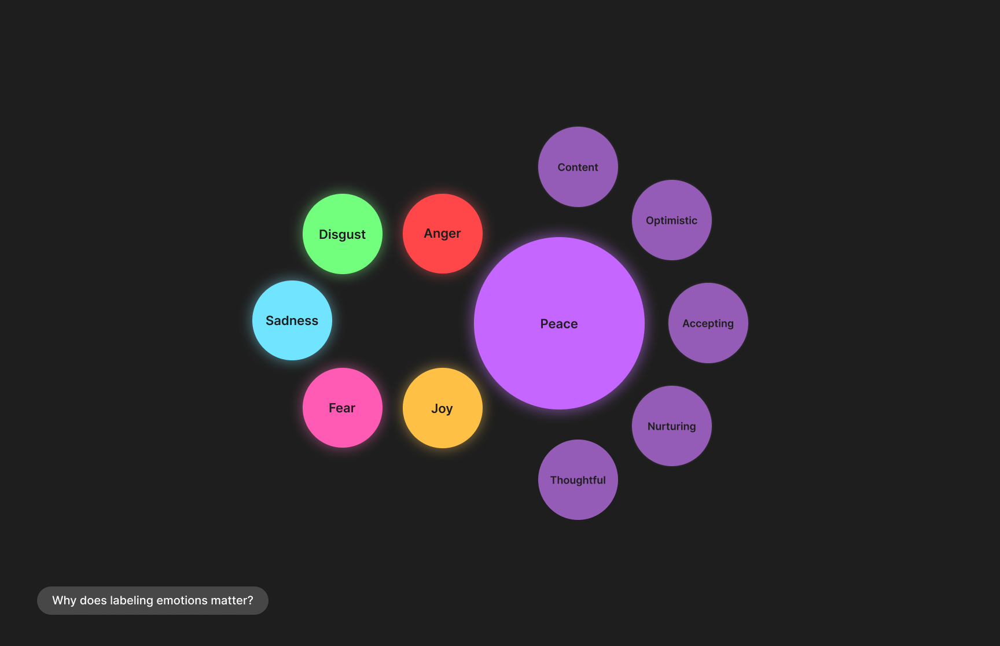
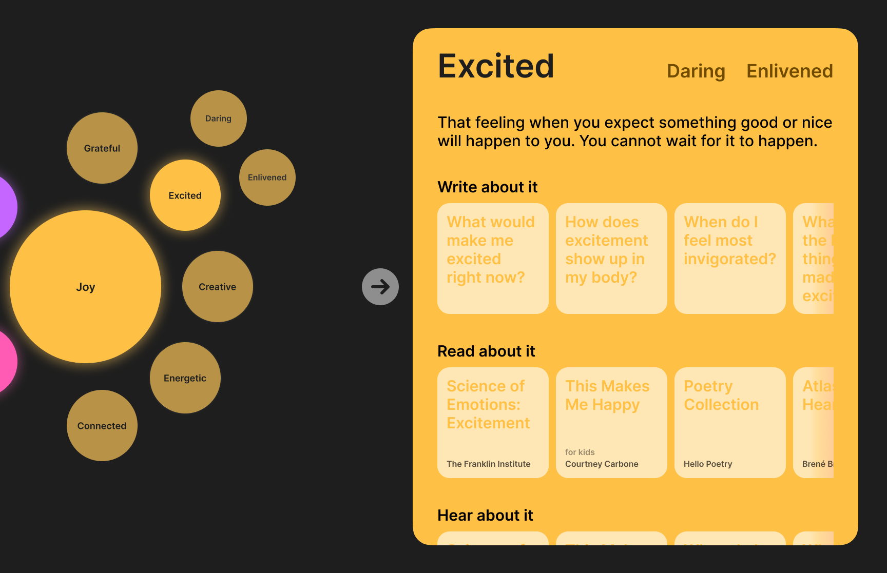
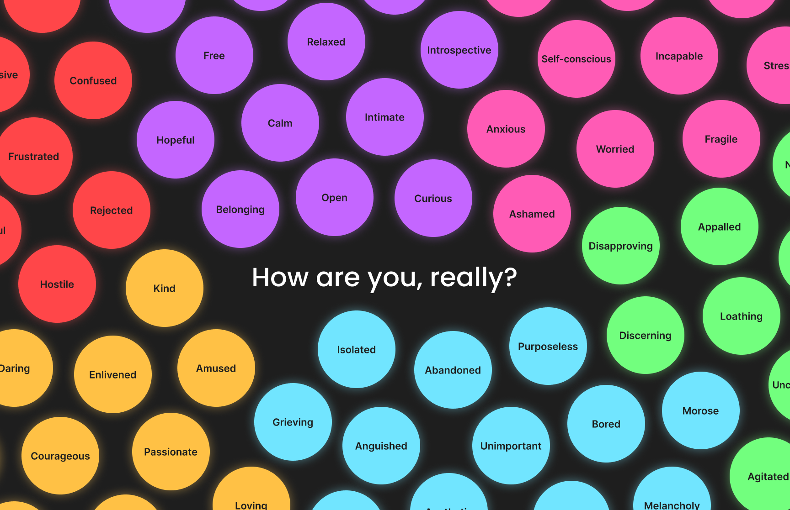
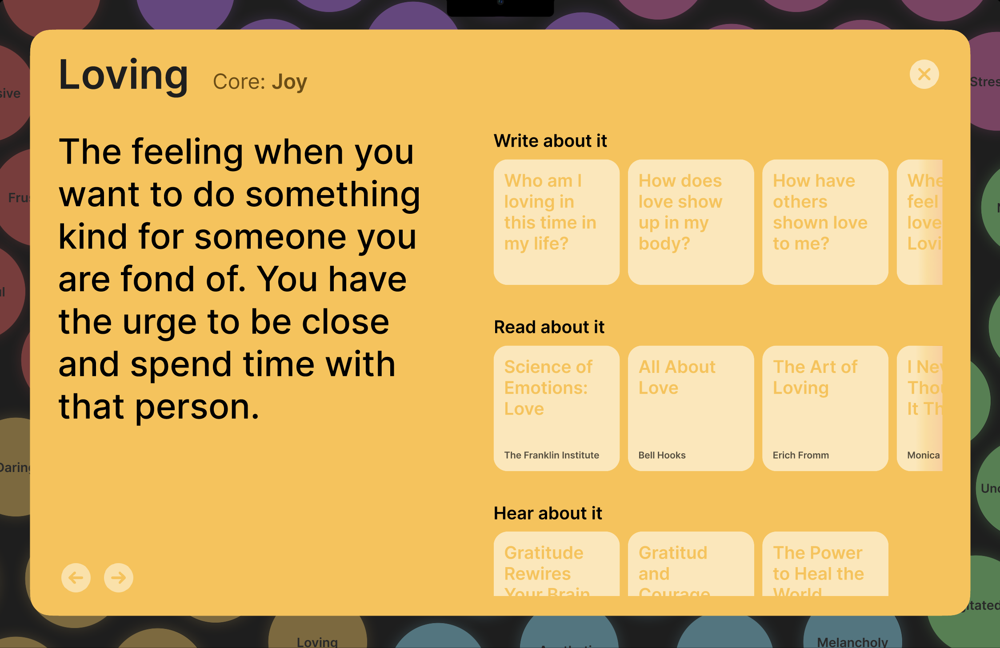
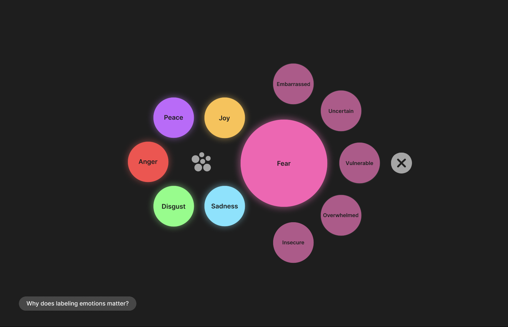
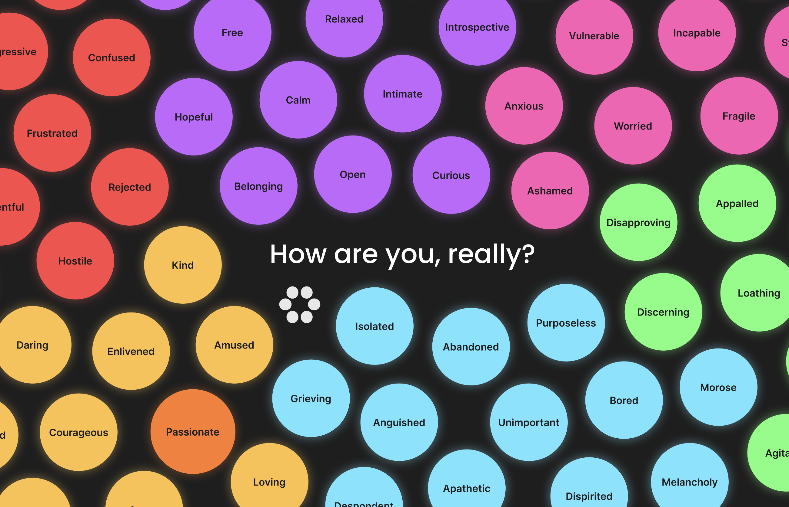
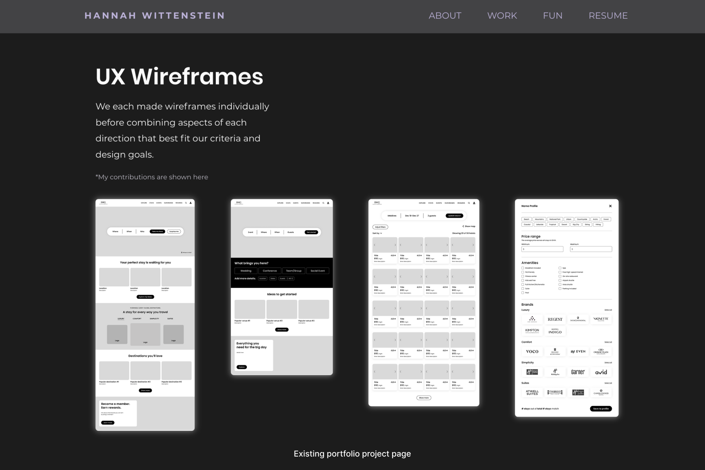
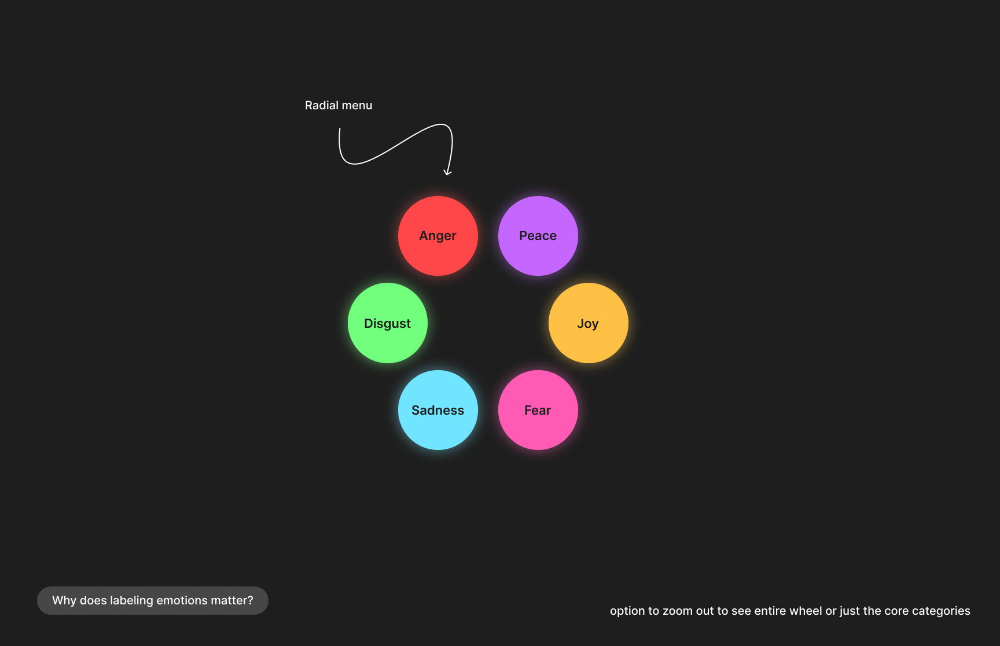
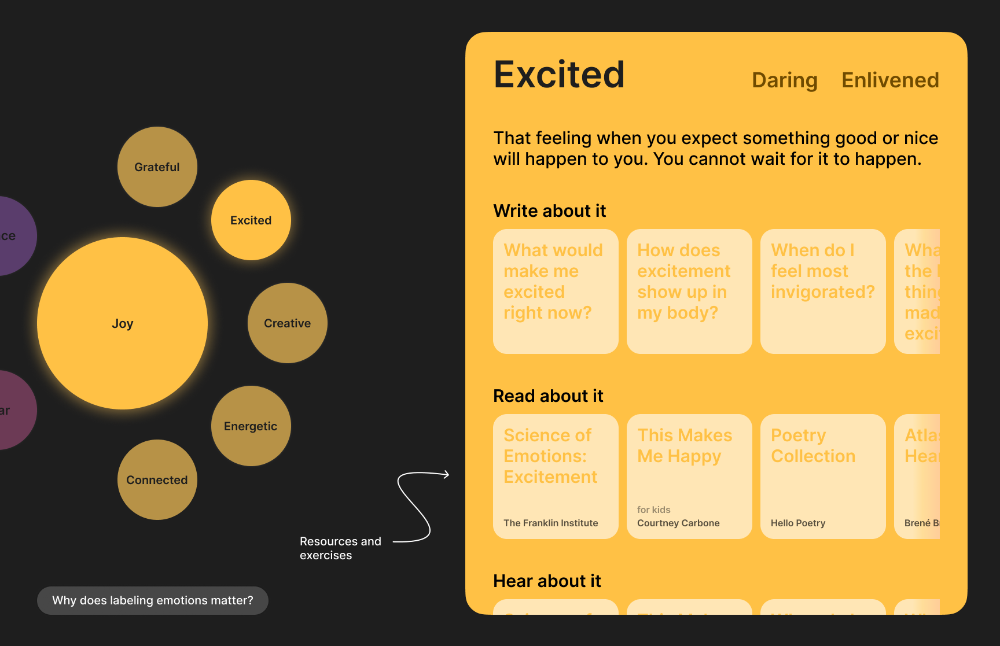
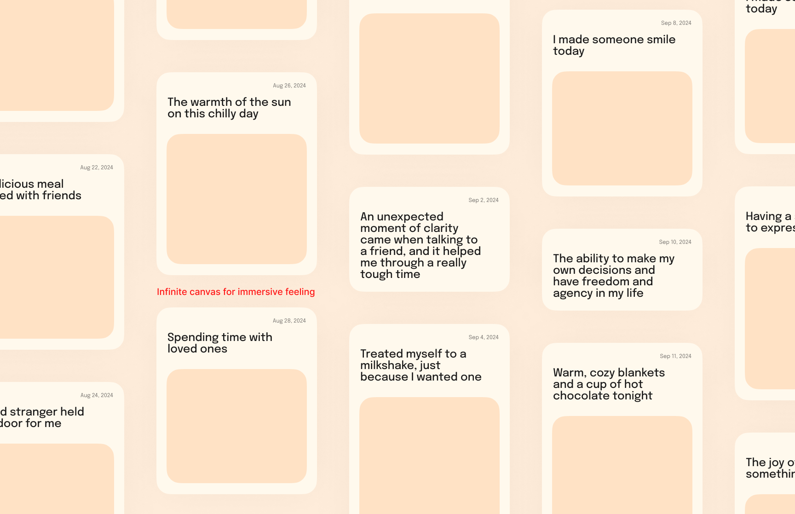

# **FP4 \- Final Project Writeup**

## Part 1: Website Description

Describe your website (300 words).

* What is the purpose of your website?   
* Who is the target audience?  
* What information do you convey with your website?   
* How is it interesting and engaging? 

## Part 2: User Interaction

How a user would interact with your website? For each step, briefly but clearly state the interaction type & how we should reproduce it.

1. Interaction type. Click on X on page Y / scroll on page X, etc.  
2. 

## Part 3: External Tool

Describe what important external tool you used (JavaScript library, Web API, animations, or other). Following the bulleted list format below, reply to each of the prompts.

1. Name of tool1  
   * Why did you choose to use it over other alternatives? (2 sentences max)  
   * How you used it? (2 sentences max)  
   * What does it add to your website? (2 sentences max)  
2. Name of tool2

## Part 4: Design Iteration

Describe how you iterated on your prototypes, if at all, including any changes you made to your original design while you were implementing your website and the rationale for the changes. (4-8 sentences max)

## Part 5: Implementation Challenge

What challenges did you experience in implementing your website? (2-4 sentences max)

## Part 6: Generative AI Use and Reflection

Describe how you used Generative AI tools to create this final project (fill in the following information, write \~500 words in total).

Document your use of all GenAI tools — ChatGPT, Copilot, Claude, Cursor, etc. using the template below. Add/Delete rows or bullet points if needed, and replace Tool1/Tool2 with the name of the tool.

### Usage Experiences by Project Aspects

Feel free to edit the column \_ (other?) or add more columns if there's any other aspect in your project you've used the GenAI tools for.

For the following aspects of your project, edit the corresponding table cell to answer:
- *Usage*: Whether you used / did not use this tool for the aspect. Enter [Yes/No]
- *Productivity*: Give a rating on whether this tool makes your productivity for X aspect [1-Much Reduced, 2-Reduced, 3-Slightly Reduced, 4-Not Reduced nor Improved, 5-Slightly Improved, 6-Improved, 7-Much Improved].

| Tool Name | Ratings | design | plan | write code | debug | \_ (other?) |
| :---- | :---- | :---- | :---- | :---- | :---- | :---- |
| Tool1 | Usage | Yes/No | Yes/No | Yes/No | Yes/No | Yes/No |
| Tool1 | Productivity | 1~7 | 1~7 | 1~7 | 1~7 | 1~7 |
| Tool2| Usage | Yes/No | Yes/No | Yes/No | Yes/No | Yes/No |
| Tool2 | Productivity | 1~7 | 1~7 | 1~7 | 1~7 | 1~7 |

### Usage Reflection

> Impact on your design and plan 
* It matched my expectations and plan in [FP2](#generative-ai-use-plan) in that … For example, 
  1. Tool1: 
  2. Tool2:
* It did not match my expectations and plan in [FP2](#generative-ai-use-plan) in that … For example, 
  1. Tool1: 
  2. Tool2:
* GenAI tool did/did not influence my final design and implementation plan because … For example, 
  1. Tool1: 
  2. Tool2:

> Use patterns
* I accepted the generations when …  For example, 
  1. Tool1: this tool once suggested … and I adjusted my design according to the suggestion because … 
  2. Tool2: 
* I critiqued/evaluated the generated suggestions by … For example, 
  1. Tool1: this tool once suggested … but I modified/rejected the suggestion because … 
  2. Tool2: 

> Pros and cons of using GenAI tools
* Pros
  1. Tool1: 
  2. Tool2:
* Cons
  1. Tool1: 
  2. Tool2:

### Usage Log

Document the usage logs (prompts and chat history links) for the GenAI tools you used. Some tools may not have an easy way to share usage logs, just try your best! Some instructions for different tools:

1. [ChatGPT](https://help.openai.com/en/articles/7925741-chatgpt-shared-links-faq) / [Gemini](https://support.google.com/gemini/answer/13743730?hl=en&co=GENIE.Platform%3DDesktop): share the anonymous link to all of your chat histories relevant to this project
2. [GitHub Copilot (VSCode)](https://code.visualstudio.com/docs/copilot/copilot-chat#:~:text=You%20can%20export%20all%20prompts%20and%20responses%20for%20a%20chat%20session%20in%20a%20JSON%20file%20with%20the%20Chat%3A%20Export%20Session...%20command%20(workbench.action.chat.export)%20in%20the%20Command%20Palette.): export chat histories relevant to this project.

---

# **FP3 \- Final Project Check-in**

Document the changes and progress of your project. How have you followed or changed your implementation & GenAI use plan and why? Remember to commit your code to save your progress.

## Implementation Plan Updates

- [ ] ...

## Generative AI Use Plan Updates

- [ ] ...

# **FP2 \- Evaluation of the Final project**

## Project Description

Aligned with my passion for mental health education and skill-building, I want to create an interactive site that teaches emotional granularity, using an animated radial menu to display the wheel. Clicking on an emotion displays more information such as definitions, examples, coping strategies, exercises, journaling prompts, and more media. Such information will be relevant to each emotion so users can gain a solid understanding of the complexities of granular emotions.

## High-Fi Prototypes

### *Prototype 1*

The user feedback I received showed that the visuals, colors, and bubble layout served to create a highly engaging, interactive interface. The card format allowed for quick scanning and felt fun to use. Some buttons and icons were not as intuitive as they should be, but the radial menu was easy to navigate and activated System 1 thinking due to its minimalism.  

### *Prototype 2*

User feedback for the second prototype revealed that the bubble layout of all of the granular emotions was very fun and invited curiosity. The hover effects and illuminated circles added visual appeal, making the interactions more engaging. The format of the cards (where information and resources can be found) also engaged System 1 but felt more educational than the card interface of Prototype 1. 

## Usability Test

I conducted usability tests with 2 participants, using the think-aloud protocol. I found that some back buttons and icons were unclear in terms of their function, and one participant suggested changing the back button to an X to emphasize that it is closing something. I implemented this in the refined prototype. Participants also felt strongly that the visuals and organization of the emotions were highly engaging, fun to look at, and simple to understand. One participant mentioned that it would be nice to switch between the radial view of the main emotions and the bubble view of granular ones to better understand the hierarchy and nesting. I decided to implement this suggestion, adding a toggle to switch between the radial menu and bubble view for different navigation options. To do this, I added a button at the center of the radial menu to see the exploding bubble view, and a button in the bubble view to switch to the radial menu. 

It was also noted that specific menu functions can be improved: one participant wanted to be able to return to the core menu rather than just the expanded view (with one circle being larger) for a more satisfying experience. I implemented this by adding the option to see the expanded or condensed view of the radial menu. Further, the card format in Prototype 1 was preferred, so I decided to link the emotions in the bubble view to those cards (as opposed to the card shown in Prototype 2). Both participants thought that the card displaying digestible information, like relevant journaling prompts, reading recommendations, and video/podcasts, to learn about a specific emotion was visually pleasing and allowed for scannability.

## Updated Designs

The refined design combines both the radial menu and bubble menu designs so users can better orient themselves within the emotions wheel. Back buttons were changed to X’s to better convey their function in closing elements on the screen. Icons representing the different menu types were incorporated into the design for improved navigation between the views. I also made changes to the card display, making the animations smoother and more intuitive. Additionally, a button was added to the expanded menu view so users can easily return to the main menu that displays only the core emotions. 

## Feedback Summary

In the feedback session during lab, Hedy noted that the hover effects and illuminating buttons are a great way of engaging the audience and are very interactive. She suggested a darker color for text on the cards to improve readability, underlining clickable text for clarity, and repositioning the mode switch button to a corner for better accessibility and intuitiveness. Liz recommended altering colors for nested emotions to signal more specific information and prompting users to "dig deeper" into sub-emotions. She also suggested using similar interactive bubble effects in both the main and sub-emotion views. Christina recommended animations that enhance storytelling and functionality, proposing the use of lines, size variations, and shading to suggest hierarchy and guide users through different levels of the wheel. 

These insights invite adjustments to both visual and interactive aspects of the design. To improve readability and usability, I’ll incorporate a darker text color on the cards and make elements more obviously clickable as suggested. The repositioning of the mode switch button to a corner may also streamline the user experience, making it easier to locate and navigate between the two. For interactivity, I’ll explore adding subtle color changes and prompts when users explore nested emotions, encouraging them to delve into sub-emotions. Enhancing the sub-emotion view with similar bubble interactivity will create a cohesive feel across the platform. Lastly, animation and hierarchy will be adjusted to improve storytelling and structure, drawing attention to the relationships between main emotions and sub-emotions. For example, using lines, varying sizes, and shades can make it easier for users to understand the emotional breakdown while maintaining a visually engaging flow. This feedback will ultimately create a more intuitive, inviting, and impactful experience for users. 

## Milestones

The implementation of the interactive emotions wheel will begin by establishing core structures in React.js, HTML, and CSS, with each playing a different role in creating a seamless, educational, and engaging experience.
For the front-end foundation, I’ll use HTML to define the site's core structure, ensuring accessibility and semantic organization. CSS will refine the visual aesthetics, creating a fun, inviting space that encourages exploration. This includes thoughtfully choosing color schemes, typographic elements, and layout that reflect the emotional themes of the project. Initial CSS styling will focus on setting up responsive layouts to ensure the site is usable on both desktop and mobile devices.

React.js will be pivotal in handling the interactivity of the emotions wheel, making it feel dynamic and responsive to user input. First, I will explore the React library to integrate animations, possibly using libraries like Framer Motion or React Spring, to bring subtle movement to the wheel. Each segment of the emotions wheel will correspond to a different emotion and will be clickable, displaying information, journaling prompts, and resources relevant to that specific emotion. As users explore each segment, the information about each emotion, alongside exercises and relevant resources, will be displayed interactively.

Additionally, I plan to incorporate a data structure or dataset that categorizes emotions by intensity and type, which will help the wheel to reflect a comprehensive emotional range. In the later stages, the focus will shift to refining these interactions to ensure smooth transitions and responsive feedback, providing users with a satisfying and intuitive experience. The final weeks will involve testing and debugging, as well as ensuring consistency in design and functionality, so that the site effectively serves as an engaging educational tool for emotional granularity. 

### *Implementation Plan*

- [ ] Week 9 Oct 28 \- Nov 1:
  - [X] FP1 due
  
- [ ] Week 10 Nov 4 \- Nov 8:   
  - [X] FP2 due
  - [ ] Explore React.js as a library to use for animations

- [ ] Week 11 Nov 11 \- Nov 15:
  - [ ] FP3 due
  - [ ] Settle on a dataset to use for all of the emotions
  - [ ] Start working in React.js to develop the site's core functions

- [ ] Week 12 Nov 18 \- Nov 22: 
  - [ ] Refine CSS and HTML to make the site visually pleasing
  - [ ] Continue adding animations and interactions in JS 

- [ ] Week 13 Nov 25 \- Nov 29:  
  - [ ] Thanksgiving
  - [ ] Take a much needed break to rest and recharge

- [ ] Week 14 Dec 2 \- Dec 6:  
  - [ ] Make final refinements
  - [ ] FP4 due 

### *Libraries and Other Components*

List the JS libraries and other components (if applicable) that you plan to use. 
* 
- React.js for animations and intuitive interactive elements
- Framer Motion or React Spring for subtle movements and seamless animations

## Generative AI Use Plan

I will use ChatGPT primarily for troubleshooting, and refining complex code logic. ChatGPT can help me brainstorm ways to structure the data for the emotions wheel, offer guidance on improving the user interface based on feedback, and work through complex logic. It’s particularly useful when I need assistance with CSS animations or React component structures that require step-by-step explanations or creative approaches to interactivity.

However, I won’t rely on ChatGPT for highly specific and nuanced UX/UI decisions that require user testing and iterative design based on human feedback. While ChatGPT can provide general design suggestions, it may not fully capture subtle user needs or insights that come from contextual testing. Therefore, for fine-tuning the interface based on how users interact with the wheel, I will still depend on direct user feedback. I will also not use ChatGPT to write my code for me, as it can often produce incorrect or poorly stylized code and it would remove the learning experience from this project. 

### *Tool Use*

 What would you use? Edit the list given your plan. For each tool, explain briefly on what do you expect Generative AI to help you with and what might it not be able to help you with.

* ChatGPT  
  * I will use it for troubleshooting and refining complex code logic because it can help me improve interface elements based on feedback and think through complex structures and logic.   
  * I will not use it for design decisions or writing code from scratch because it might not be able to help me with nuanced, emotionally charged UI/UX decisions and may use syntax that does not align with industry standards.

### *Responsible Use*

To use generative AI responsibly, I will ensure that the technology supports my goals without compromising creativity or accuracy. While generative AI can provide suggestions for design and code, it is up to me to make those decisions based on my knowledge, intuition, and research. I’ll be careful not to let AI outputs override my more nuanced decisions that better align with my vision and the site’s purpose. As for accuracy, I will be cautious of hallucinations and fact-check the information that AI produces. Especially for complex interactions or design-centered functionalities, I will review, test, and adjust code as necessary to ensure reliability and encourage my own learning. If I use AI, I’ll be transparent about where and how it was applied.  

---

# **FP1 \- Proposal for Critique**

## Idea Sketches

### *Idea 1: Portfolio in React*

The purpose of this would be to create an improved version of my existing portfolio in React, adding more interactive elements, scroll/text effects, and smoother transitions. I plan to check contrast, navigation, and code structure to ensure accessibility in my design. On my portfolio, I would like to convey the process and final result of four projects, an about page, and a captivating home screen. Some design concerns I have are: How much interaction is too much? How do I use animations in ways that don’t take away from the actual content?

### *Idea 2: Emotions Wheel*

Aligned with my passion for mental health education and skill-building, I want to create an interactive site that teaches emotional granularity, using an animated radial menu to display the wheel. Clicking on an emotion displays more information such as definitions, examples, coping strategies, exercises, journaling prompts, and more media. Such information will be relevant to each emotion so users can gain a solid understanding of the complexities of granular emotions. I plan to use high contrast and simple information architecture for accessibility. A design concern I have is: How might I make this experience unique, educational, and entertaining?

### *Idea 3: Gratitude Wall*

Gratitude is an important skill and major factor in overall well-being, so with this interface, I aim to encourage people to take note of what they’re grateful for in a visual format that they can always return to. It will utilize local storage and infinite scroll interactions. Notes of gratitude will be organized in a loose grid and incorporate various media: photos, writing, audio, videos, etc. To increase accessibility, I will make navigation clear and visual/cognitive load as low as possible. Some design concerns I have are: With an infinite canvas, how can I prioritize navigation? How will the notes be grouped/categorized/sorted?

## Feedback Summary

For the portfolio project, feedback focused on relevance and scope. Since I already have a relatively interactive site live, it may not be necessary or as valuable to code it from scratch. It also may not be feasible to code all projects due to scope and time constraints. Katie and Naimah suggested refining the project selection to highlight only the most relevant or impactful projects, as this could streamline development and enhance focus. Naimah also recommended prioritizing specific projects to help keep the project within a manageable scope.

The emotions wheel idea drew similar feedback from classmates regarding data needs. Chance and Katie both raised the importance of having a dataset to support the wheel’s function, especially if it includes emotional resources. They suggested finding an external dataset if creating a new one is impractical and too time-consuming. Katie and Naimah also pointed out that including a journaling feature could make the emotions wheel more complex, which might necessitate narrowing the scope. They advised considering whether additional complexity aligns with the overall project goals.

For the gratitude wall, several people raised design and technical considerations. Chance questioned how low data volume might affect the wall’s interactivity and user experience. Katie and Naimah both emphasized the need for user control over customization and navigation; users should have the ability to change colors or decide the grouping of notes. The concept of an infinite canvas also brought up questions about navigation and accessibility. Naimah suggested considering an infinite scroll or drag-and-drop library to facilitate usability.

## Feedback Digestion

In the lab, the feedback on the emotions wheel project highlighted considerations around complexity, usability, and data sets, which are valuable as I refine the design.

One prominent point was the need for a dataset to support emotional resources, as both Chance and Katie noted that relying on external data could streamline development and ensure that users receive accurate, relevant information. I’ll prioritize this critique by exploring existing emotion lexicons or datasets like the NRC Emotion Lexicon, which could allow users to access information relevant to their emotions without developing a new dataset from scratch. Using a dataset will simplify the design, ensure consistent information, and avoid overcomplicating the wheel’s functionality with potentially unmanageable features.

Another key critique focused on scope. Katie and Naimah pointed out that incorporating a journaling aspect might add complexity and shift the wheel away from its core focus. Given this feedback, I will keep journaling optional or avoid it entirely in the initial version to maintain focus on the primary interactive elements. This way, I can ensure a clean, engaging experience that educates users about emotions without overwhelming the interface with extra features.

A final area of feedback was about user experience and interaction. Katie and Naimah raised accessibility and usability concerns, especially around scrolling elements. I’m intrigued by the idea of an interactive wheel that could use smooth transitions or simple animations to engage users and convey information in an entertaining way. This would keep navigation intuitive and visually engaging without introducing navigational challenges, particularly for mobile users.

Ultimately, this feedback aligns with my goal of creating an educational, interactive, and well-scoped emotions wheel that is manageable to develop and enjoyable for users.
